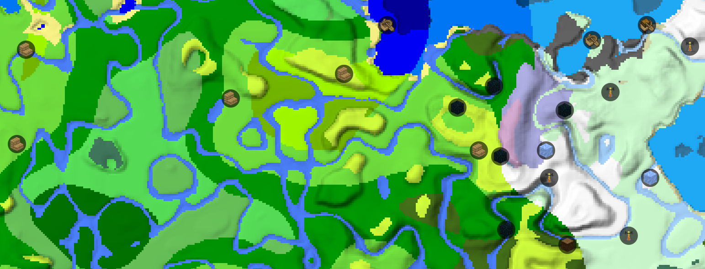

## Use online at https://map.jacobsjo.eu 

--------

# MC Datapack Map

|   |   |
|---|---|
|  | A Leaflet based map to display Minecraft biome layouts and structures of vanilla and using worldgen datapacks.  |
|   |  |

# Contributing
Contributions are welcome! For significant feature additions please ask beforehand by opening an issue or on discord.

## Setup dev environment:

1. Install python dependencies: `pip install -r requirements.txt`
2. Install node dependencies: `npm i`
3. Create vanilla datapack zip files: `npm run createZips`
4. Start dev server: `npm run dev` and open http://localhost:5173/ 
   - **dev environment requires a [browser supporting ECMAScript modules in webworkers](https://caniuse.com/mdn-api_worker_worker_ecmascript_modules)**

5. Build final page: `npm run build`
6. Test build version: `npm run preview` and open https://localhost:4173/